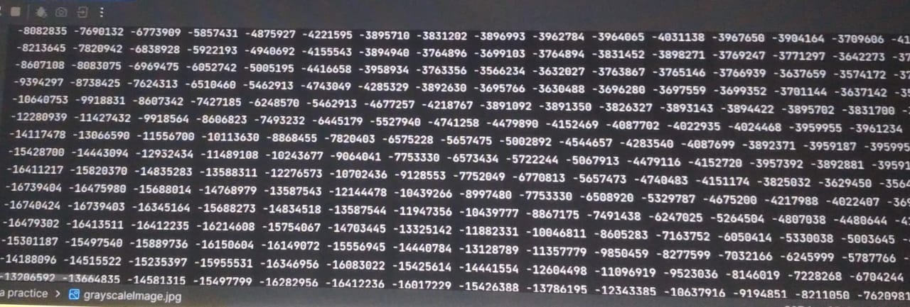
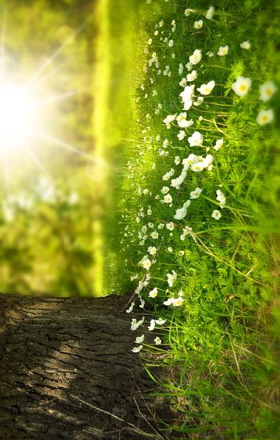

# imageEditor
image Editor is the crucial tool for  every photographer and youtuber which enables them to perform their task quickly and effectively.
     Thus for that purpose only I have created a java ImageEditor with some primary features like converting the image to graySCale,brightening the image,finding the pixels etc.
     this project also helps coding enthuciast in order to boost their confidence and enhance themselves to become a better version of themselves.

**FEATURES**
- Convert to GRAY SCALE : The image will be converted to grayish in color.

- Change BRIGHTNESS by percentage : The brightness of image will change according to the percnetage as provided by the user.

- printing PIXELVALUE of image : Images concists of pixels,this function will show u those pixels only.

  
- rotating CLOCKWISE : this feature rotates the image clockwise

  
- rotating ANTICLOCKWISE : this feature rotates the image anticlockwise.
 
  
- FLIPHORIZONTAL : this feature flips the image.
  

**let's START**

**Prerequisite**
- better to use LINUX(works in windows as well)
-  JAVA installed on system
-  java
