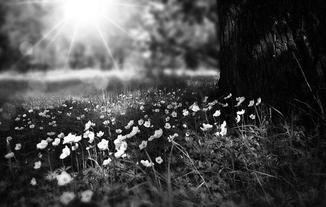

# imageEditor
image Editor is the crucial tool for  every photographer and youtuber which enables them to perform their task quickly and effectively.
     Thus for that purpose only I have created a java ImageEditor with some primary features like converting the image to graySCale,brightening the image,finding the pixels etc.
     this project also helps coding enthuciast in order to boost their confidence and enhance themselves to become a better version of themselves.

**FEATURES**
- Convert to GRAY SCALE : The image will be converted to grayish in color.

- Change BRIGHTNESS by percentage : The brightness of image will change according to the percentage as provided by the user.

- printing PIXELVALUE of image : Images concists of pixels,this function will show you those pixels.

  
- rotating CLOCKWISE : this feature rotates the image clockwise.

  
- rotating ANTICLOCKWISE : this feature rotates the image anticlockwise.
 
  
- FLIPHORIZONTAL : this feature flips the image.
  

  - BLURRING THE IMAGE : This feature blurs the image
   ![imageEditor]

**let's START**

**Prerequisite**
- better to use LINUX(works in windows as well)
-  JAVA installed on system
-  **JAVA IDE**
-  an **IMAGE**

**_LIBRARIES TO BE IMPORTED_**
- javax.imageio.ImageIO;
- java.awt.*;
- java.awt.image.*;
- java.io.File;
- java.io.IOException;
- java.nio.Buffer;
- java.util.Scanner;

**Explanation of all the function and features**

-**THE GRAY SCALING**
In the grayscale conversion process, I started by getting the height and width of the image that requires editing,then I employ a nested loop to access each individual pixel within the image.After that I assigned these pixel values to a new BufferedImage, carefully specifying its type as 'BufferedImage.TYPE_BYTE_GRAY.' As a result of this operation, a grayscale image is generated and saved in the current directory,thus representing the desired image.

In the starting, I begin by getting the height and width of the image that requires change. Next, I created a fresh BufferedImage,Within this framework, I implement a nested loop to access and process individual pixel values in the source image.

**CHANGING BRIGHTNESS OF IMAGE**
To start the process, I first get the height and width of the image. next, I created a BufferedImage,  where the next adjustments will be applied.

after that, I gave a chnace to the user,  to give a desired percentage for increasing the image's brightness. This percentage should be under 1 to 100. as the user provide input,then function is called and operation is performed.

During this , I took the red, green, and blue pixel values of the image by the percentage goven by the user. though,I took care that this valur should be from 0 to 255.

This manipulation of pixel values  increases or decreases the image's brightness as per the  input. thus, the modified image is stored  in the filename "changedbrightness.jpg,".

**PRINTING PIXEL(RGB) VALUES**
In starting, I begin by extracting the dimensions, the height and width, of the image . Subsequently, I create a fresh BufferedImage.

The next step involves check of the image's individual pixel values.

I employ the Color object, which provides a set of built-in methods for retrieving the specific color components. For example, the 'getRed()' method allows me to get the first 8 bits of the 32-bit value, corresponding to the red channel. Similarly, I can get  blue, green, and transparency components.

By using these Color object methods,I do the required task and showed the pixel correctly.

**ROTATING CLOCKWISE**
During this iteration, I gave  pixel value to the corresponding row and column within the newly created BufferedImage. This careful mapping ensures that the pixel values from the source image seamlessly transfer to their designated locations in the newly constructed BufferedImage. The result of this meticulous operation is a transformed image . This transformed image is  saved  in the name "rotatedClockwise.jpg," .

**ROTATING ANTICLOCKWISE**
Here I gave pixel value to the corresponding rows and column in the newly created buffered image.
Thus ensuring that the pixels from source image is transferred to their designated location .
this results in a image which completes our purpose of rotating it anticlockwise which gets stored in "rotatedAntiClockwise.jpg".

**FLIPPING THE IMAGE HORIZONTALLY**
in it,I started by getting the height and width of the image . then,I created BufferedImage.

it involves a nested loop getting the individual pixel values within the source image. Within it, I make adjustments to these pixel values as requirede .

This process results in a horizontally rotated version of the input image. The resulting image is then stored with the filename "flipedHorizontal.jpg" .

**BLURRING THE IMAGE**

It starts by getting the width and height of the input image.

It creates a new BufferedImage called blurredImage with the same dimensions and image type as the input image. This new image will store the blurred result.

The code then enters nested loops to iterate through each pixel in the input image. The outer loop iterates over the rows (y-coordinates), and the inner loop iterates over the columns (x-coordinates).

For each pixel at position (x, y) in the input image, it initializes variables avgRed, avgGreen, and avgBlue to 0, which will be used to accumulate the sum of color values for the pixels in the neighborhood.

It also initializes a numPixels variable to 0, which will keep track of the number of pixels in the neighborhood.

The code then enters two additional nested loops to explore the neighborhood of the current pixel. It iterates over offsetX and offsetY values from -radius to radius. These values define a square neighborhood centered around the current pixel.

For each offset, it calculates the posX and posY coordinates of the neighboring pixel.

It checks if the calculated posX and posY values are within the bounds of the input image to ensure that it doesn't go out of bounds.

If the neighboring pixel is within the image boundaries, it retrieves the color of that pixel using inputImage.getRGB(posX, posY).

It extracts the red, green, and blue color components from the retrieved pixel using bitwise operations and accumulates them in the avgRed, avgGreen, and avgBlue variables, respectively.

It increments the numPixels variable to keep track of how many pixels were included in the neighborhood.

After processing all the neighboring pixels in the neighborhood, it calculates the average color values by dividing avgRed, avgGreen, and avgBlue by numPixels.

It combines the average color values to create a new blurred pixel in the form of an integer where the red component occupies the upper 8 bits, green the middle 8 bits, and blue the lower 8 bits.

Finally, it sets this new blurred pixel as the color of the corresponding pixel in the blurredImage using blurredImage.setRGB(x, y, blurredPixel).

The process continues for all pixels in the input image.

Once all pixels have been processed, the method returns the blurredImage, which now contains the blurred version of the input image.

This code essentially implements a basic form of image blurring using a simple box filter, where each pixel in the output image is the average color of its neighborhood. The radius parameter controls the size of the neighborhood, and increasing it will result in a stronger blur effect.

**PROCEDURE****(STEPS TO BE FOLLOWED)**
- OPEN YOUR FAVOURITE JAVA IDE(EG.INTELLIJ)
- write the code for respective function according to your purpose
- the functions represented  here are:
- changing image to gray scale
- changing brightness of image
- printing pixel values of image
- rotating image clockwise
- rotating image Anticlockwise
- flipping the image horizontally
- after writing the code,run the code by terminal.
- your desired image will be created succesfully.

 **IMPORTANT POINTS TO UNDERSTAND**
 - public class imageeditor {
 This line defines the start of the imageeditor class.

-public static BufferedImage convertToGrayScale(BufferedImage inputImage){
This method takes a BufferedImage as input and converts it to grayscale. It returns a new grayscale BufferedImage.

-int height = inputImage.getheight();
int width = inputImage.getwidth();
These lines attempt to get the height and width of the input image.

-BufferedImage outputImage = new BufferedImage(width, height,
    BufferedImage.TYPE_BYTE_GRAY);
     a new BufferedImage is created with the width and height and set to grayscale mode (TYPE_BYTE_GRAY).

    -for(int i=0;i<height;i++){
    for(int j=0;j<width;j++){
        outputImage.setRGB(j, i, inputImage.getRGB(j,i));
    }
}
This nested loop runs over each pixel, getting the color value, and sets  pixel in the output grayscale image with the same color value.

-public static BufferedImage changeBrightness(BufferedImage inputImage, int increase){
This method takes an input image and an integer increase value to adjust the brightness. It gives a new BufferedImage with the adjusted brightness.

- int height = inputImage.getHeight();
int width = inputImage.getWidth();
BufferedImage outputImage = new BufferedImage(width,height,BufferedImage.TYPE_3BYTE_BGR);
Here, it gets the height and width of the input image and creates a new BufferedImage with the same dimensions and in the RGB color mode (TYPE_3BYTE_BGR).

-for(int i=0;i<height;i++){
    for(int j=0;j<width;j++){
        // ...
    }
}
Inside the nested loops, it runs through each pixel of the input image, getting the red, green, and blue color components, and adjusting them based on the  increase value to change brightness.

The program contains similar methods for rotating the image clockwise, anticlockwise, and flipping it horizontally. they have similar structure.

-public static void printPixelValues(BufferedImage inputImage){
This line creates a File object pointing to the input image file named "image.jpg."

-try {
    BufferedImage inputImage = ImageIO.read(inputFile);
    // ...
} catch (IOException e) {
    e.printStackTrace();
}
Inside a try-catch block, it attempts to read the input image using ImageIO.read(inputFile) and handles any potential IOException that may occur.

The program then calls the various image processing methods, creates new image files for the processed images, and writes the processed images to those files using ImageIO.write(). 

  **CODE EXCERPTS**
  
  
  
  
  

  **output images of code**
  
  
  
  

  
  

  

  
  
